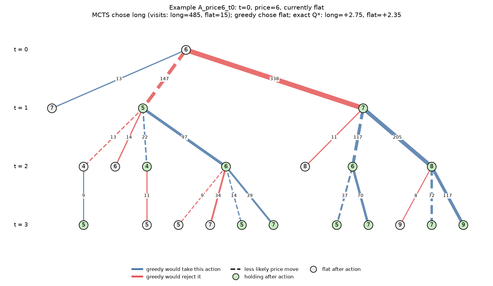
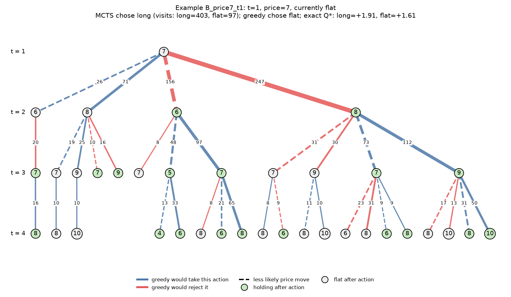
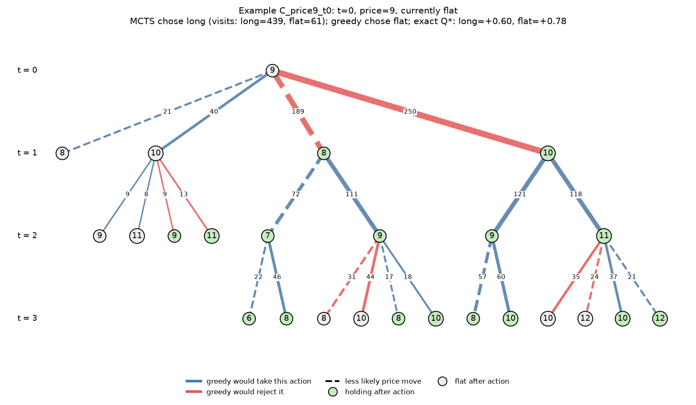

# The Bridge: A Monte Carlo Tree Search Decision Engine

## Summary

I built a Monte Carlo Tree Search (MCTS) agent from first principles, deriving the underlying math at each stage: Monte Carlo estimation, Markov Decision Processes, UCB1 from Hoeffding's inequality, and rollout-based value estimation. The agent was tested on tic-tac-toe and on a stochastic trading simulation with transaction costs. In the trading simulation it beat a one-step greedy baseline by about 0.85 profit units per episode, and its decisions were checked against the exact optimal solution of the same problem.

## 1. The math

Full derivations are in `docs/derivations/`.

- **Monte Carlo error (Week 1).** For $N$ i.i.d. samples with variance $\sigma^2$, $\mathrm{Var}(\bar X_N) = \sigma^2/N$, so the standard error is $\sigma/\sqrt N$. Chebyshev's inequality then gives the law of large numbers. An empirical error-vs-$N$ plot follows the $1/\sqrt N$ curve (`results/figures/week1_convergence.png`).
- **MDPs (Week 2).** The Bellman optimality equation is
  $$V^*(s) = \max_a \sum_{s'} P(s' \mid s, a)\big[R(s,a,s') + \gamma V^*(s')\big].$$
  Value iteration and policy iteration were implemented from scratch on a gridworld, agreed with each other, and were checked against the Bellman condition at every state.
- **UCB1 (Week 3).** Hoeffding's bound $P(\mu > \bar X_n + \epsilon) \le e^{-2n\epsilon^2}$ yields a confidence radius that shrinks with the number of visits $n$ and grows slowly with the total visits $t$. The selection rule is $\bar X_n + c\sqrt{\ln t / n}$, with $c = \sqrt 2$ for rewards in $[0,1]$.
- **Rollouts and backpropagation (Week 4).** A random rollout is an unbiased estimate of the rollout policy's value from that state, and averaging many of them converges by the law of large numbers. Backpropagation maintains a running mean, $\bar X_{n+1} = \bar X_n + \tfrac{1}{n+1}(Z - \bar X_n)$, whose step size shrinks as evidence accumulates, which is the Bayesian-style behavior of a posterior.

## 2. The agent

Each decision runs a fixed budget of iterations of select (UCB1), expand, simulate (random rollout), and backpropagate. The agent plays the most-visited root action.

For the trading problem the search was adapted in three ways. The problem has one player, so values are plain total reward with no perspective flipping. Because one action can lead to different prices, children are keyed by (action, next state) and statistics are kept per action. Returns are propagated as return-to-go, $G_t = r_t + G_{t+1}$, and the exploration constant is scaled to the reward range ($c = 3.0$, not tuned).

## 3. Results

### 3.1 Tic-tac-toe

100 games per opponent, alternating who moves first, 200 iterations per move. Tic-tac-toe is a draw under perfect play, so draws are expected against a strong opponent.

| Opponent | MCTS wins | MCTS losses | Draws |
|---|---|---|---|
| Random | 89 | 2 | 9 |
| Greedy (takes a win, else blocks, else random) | 33 | 7 | 60 |

### 3.2 Trading simulation

**Environment.** The price is an integer from 0 to 20 that moves $\pm 1$ each step, mean-reverting: the probability of an up-move is $0.5 + 0.05\,(10 - \text{price})$, clipped to $[0.05, 0.95]$. Each step the agent chooses to be flat or long one unit. Switching costs 0.5. The step reward is position × price change − fee, over 15 steps. Profit is in price units, so there is no currency or percentage interpretation.

**Greedy baseline.** It picks the action with the best exact one-step expected reward, so it only buys when one step of drift exceeds the fee (price 4 or below). It has perfect one-step information and no planning beyond it.

**Evaluation.** 300 episodes, 500 MCTS iterations per move. Both agents faced the identical market path in each episode (paired comparison), which removes luck from the difference. Intervals are 95% ($\pm 1.96\,\hat\sigma/\sqrt n$).

| | Mean return per episode |
|---|---|
| MCTS | +1.088 ± 0.242 |
| Greedy | +0.237 ± 0.124 |
| MCTS − greedy (paired) | **+0.852 ± 0.240** |

MCTS was better in 112 episodes, tied in 140, and worse in 48. The interval for the difference excludes zero.

### 3.3 Comparison with the exact solution

The trading MDP is small enough to solve exactly by backward induction (the finite-horizon Bellman backup from Week 2). The exact expected return from the start state is **+1.052 for the optimal policy** and **+0.226 for greedy**. Both sampled means above are consistent with these: MCTS's interval contains the optimum, and greedy's contains its exact value. In other words, MCTS captured essentially all of the available improvement over greedy, to within what 300 episodes can resolve.

At the decision level, on 450 decisions along 30 MCTS-driven episodes (a separate seed range from the evaluation above):

| | MCTS | Greedy |
|---|---|---|
| Picks an optimal action | 416 / 450 | 404 / 450 |
| Mean regret per decision | 0.017 | 0.027 |

They disagreed on 28 decisions. **MCTS was optimal in 20 of those and greedy in 8**, so MCTS is not perfect. Almost all of the profit gap comes from this small set of decisions.

## 4. Annotated examples

In each figure, edge thickness is the number of search iterations through that branch, red edges are actions greedy would reject at that state, blue edges are actions greedy would also take, and dashed edges are the less likely price moves.

### Example A: buying early at price 6



At $t=0$, price 6, holding nothing, greedy computes an expected price change of $0.7(+1) + 0.3(-1) = +0.4$, subtracts the 0.5 fee, gets $-0.10$, and waits. MCTS sent 485 of its 500 iterations through `long` and 15 through `flat`. The exact solution agrees with MCTS: $Q^*(\text{long}) = +2.75$ versus $Q^*(\text{flat}) = +2.35$. The fee is paid once, but the drift pays on every step the position is held, a delayed payoff that a one-step player cannot see. The search also keeps counting the unlikely branch where the price falls (30% probability, dashed) instead of ignoring it.

### Example B: the same idea with a smaller margin



At $t=1$, price 7, holding nothing, greedy's one-step value for buying is $+0.3 - 0.5 = -0.20$, so it waits. MCTS chose `long` with 403 visits to `flat`'s 97. The exact values are $+1.91$ versus $+1.61$. The margin here (0.30) is smaller than in A (0.40), and the search sent more visits to the rejected action (97 versus 15), which is consistent with it being less certain.

### Example C: a case where MCTS is wrong



At $t=0$, price 9, holding nothing, MCTS bought (439 visits against 61), but the exact solution says waiting is better: $Q^*(\text{flat}) = +0.78$ versus $Q^*(\text{long}) = +0.60$. The margin is only 0.18. Likely causes are sampling noise at 500 iterations and the bias of random rollouts, which estimate how a random player would do from a leaf, not an optimal one. The second cause is what a learned value function would address.

## 5. Limitations

- The market is a simulation I designed, with mean reversion built in. The result is that multi-step planning beats myopic decisions under transaction costs and uncertainty. It is not a claim about real markets.
- MCTS uses a simulator of the market dynamics to imagine futures. Greedy uses only the exact one-step expectation. The comparison is planning versus myopia, not equal information.
- The exploration constant ($c = 3.0$) and iteration budget (500) were my first choices and were not tuned.
- The decision-level statistics come from 30 episodes along MCTS-driven trajectories, so they are indicative, not a full audit of the policy.
- The tic-tac-toe table reports counts without confidence intervals, against a simple hand-coded baseline.

## 6. Reproducing the results

```bash
python -m pytest
python -m src.bridge.monte_carlo.convergence_check
python -m src.bridge.mcts.visit_count_check
python -m src.bridge.mcts.tournament
python -m src.bridge.mcts.trading_eval
python -m src.bridge.mcts.exact_check
python -m src.bridge.viz.tree_plot
```

All randomness is seeded, so reruns reproduce the numbers above.
